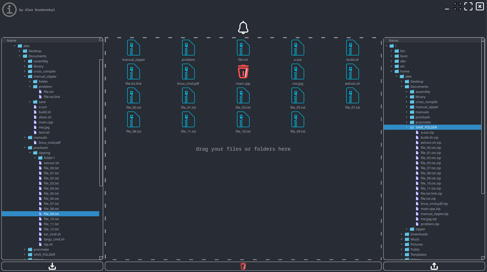

# DrZipper

## About
This project is a simple UI tool for fast creating zip archives. Written in Qt Framework for Linux platform.

The project tries to follow the "all in one" concept, means there is no pop-ups, appearing when uploading, saving
archives or error occuring.

## Features
* drag-and-drop file or folder uploading
* relatively fast creation of zip archives
* convenient and simple user interface

## Limitations
* supports only zip output format
* symlinks are ignored
* total upload size 500 MB
* up to 40 folders or files can be upload for zipping

## Requirements
* Qt Creator 12.0.2 based on Qt 6.6.2 library
* libzip 1.10.1
* compiler that supports c++17 standart